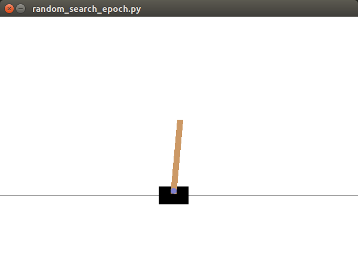
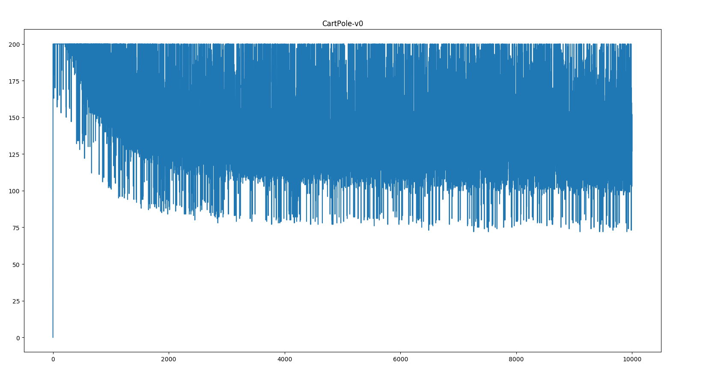
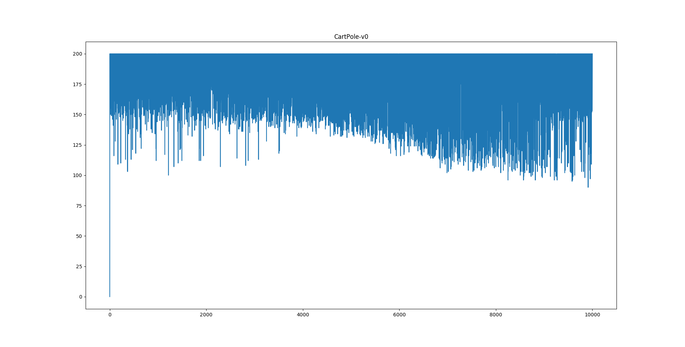
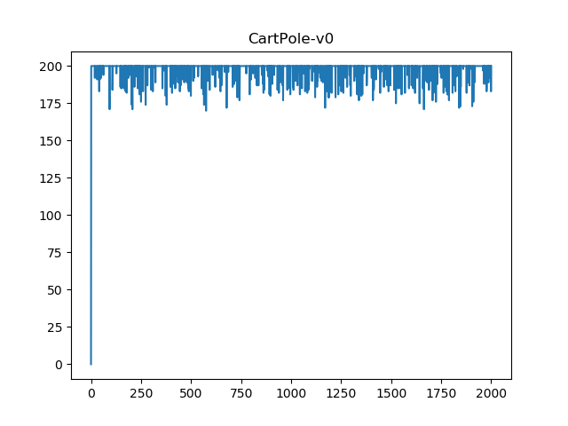
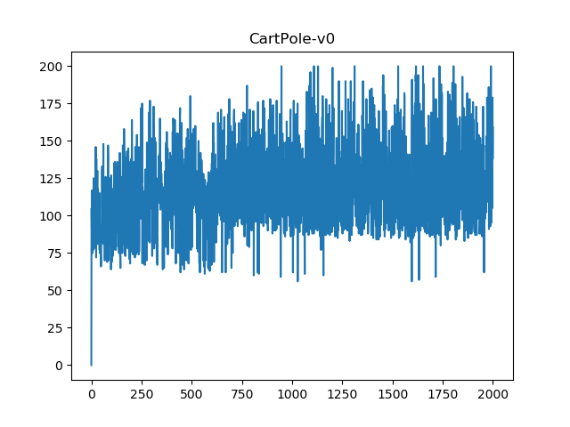

## Normal random search

**1. Task description**
'CartPole-v0' in openai gym: using left or right action to control the tiny car to keep the balance of the bar standing on it. See figure-0.



​                                                                                     figure-0

**2. Method**
Optimize a W that make a policy like this
$$
W \times observation = a
$$
we use \hat{W} = W + random\_bias to generate new weight and replace W with \hat{W} when \hat{W} performs better.

script: *src/random_search_epoch.py*
use random bias to generate new weight, then we got figure-1



​										figure-1

Obviously, the average is above 100. But we can see the reward slip down quickly

To fix the **slip down** problem, I add control such as `epoch_reward > 150` , expecting to prevent small reward.

```python
if epoch_reward < 150 and epoch_reward > all_reward[-1]:
		update_weight
```

then we got


​										figure-2
It is clearly that the average reward gets higher but the slip down problem is there still.

### Conclusion

From above simple experiments we can see that in simple problem, random search works. You can see more result in Appendix. Your will find the result can be **perfect** ( figure-3 ) sometimes. In another word, cart-pole task is an task for test so **do not take this task serious**.

### Appendix

**Other result**



​                                                                                     figure-3



​                                                                                     figure-4